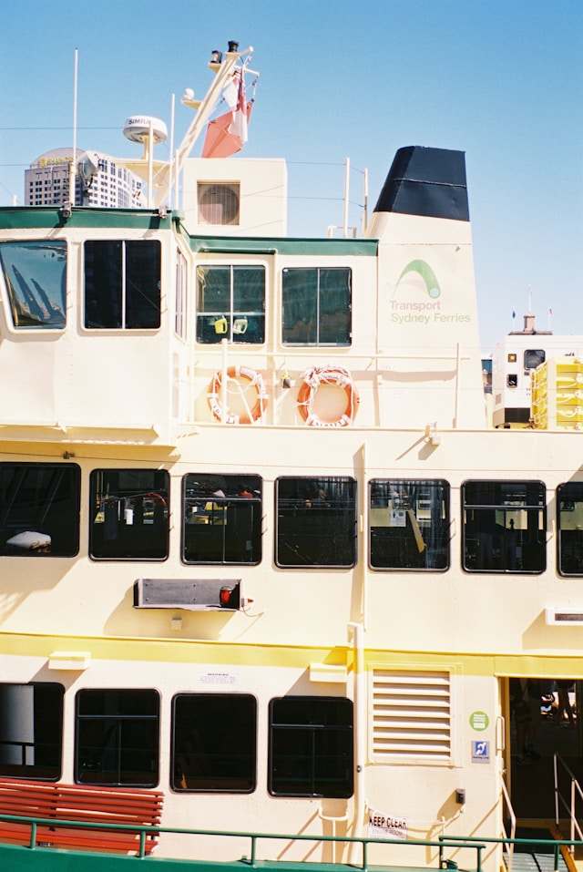
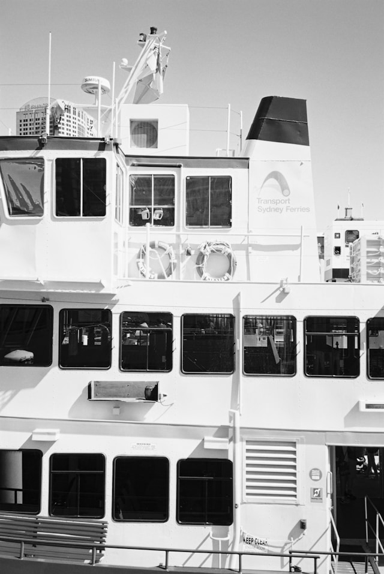

# oxidized-metal

Yeah, that's right. Rust. Let's talk about it.

## What is Rust?

Have you ever encountered a segmentation fault in C++? I'm sure you have. If you've taken any of the main programming courses at Kent State, you definitely have (I'm looking at you CS2). I could give you the true high-level breakdown of Rust but at it's core, it aims to solve that one problem: **Pointers are evil**

Now, I don't literally mean *pointers are evil*. Pointers are great. We love to use them and they have a lot of uses for us in programming. In reality, when I say pointers are evil, I mean that *pointers to dynamic memory that we allocated ourselves are evil*. That's a mouthful though, I mean try saying that 3x fast. Rust aims to fix this. The term we use for this, is called **memory safety**.

So, now let me answer that question: what is Rust? It's a tool like every other programming language. It has it's uses and there are times where you should and shouldn't use it. It has it's pros and cons, just like Python, C++ and any other language you can name off the top of your head (yes, even Lisp, even though I hope nobody is thinking about Lisp).

## Let's talk applications of Rust

**The dynamic array**: one of the first (and most common) applications of dynamic memory.

We run into a common problem with C++ that we need to allocate some array but we don't actually know what size we need this array to be. So, we throw it on the heap and stop worrying about it. But what if we forget to deallocate that memory.. or what if we forget to resize the array when we get more elements.. and the list goes on and on of problems with just straight up allocating some memory on the heap and then running with it.

Lets model this problem in Rust and see how easy it is to solve it without ripping our hair out (and segfaulting). We're going to build a simple website that:

- Sends raw bytes of [PPM images](https://en.wikipedia.org/wiki/Netpbm) to Rust
  - I wrote a tool (in Rust) that can do this, it's called [image-to-ppm](https://github.com/Struck713/image-to-ppm)
- Modifies that image data
- Send the modified data back to the browser

## Woah woah.. Rust is a native language?

With [WebAssembly](https://webassembly.org/) (or WASM), we can now write native code in Rust and then compile it to run in the browser. The meat of this tutorial is going to focus on using tools such as `wasm-pack` to compile our Rust to WASM and then run it on the web. 

## Rust installation

For those who want to follow along on their own machines, you're going to need `cargo` and `rustc`, which is Rust's package manager and compiler.

Rust is pretty easy to install and has support for Windows and Linux alike. They provide a tool called `rustup` which manages your Rust installation for you. You can get Rust at [https://www.rust-lang.org/tools/install](https://www.rust-lang.org/tools/install). For Windows users, we are going to need the build tools provided by Visual Studio 2022, which you should already have if you didn't uninstall it after CS1. 

If you already have Rust installed, run `rustup update`, which will update it to the latest version.

We also have to install `wasm-pack` which we can do with `cargo install wasm-pack` once we have Rust installed.

## Let's get going: boilerplate

So now that we have Rust installed, we can create a project with `cargo init epic-rust-project --lib`. Now, normally, we wouldn't use the `--lib` option, but in our case since we are creating a *WASM library*, we want to use `--lib` to signify that we are creating a library package.

Once `cargo init` finishes, we should see a directory structure like the one below:
```
epic-rust-project/
├── Cargo.toml
└── src
    └── lib.rs
```

In `lib.rs`, we should have some Rust code:
```Rust
pub fn add(left: usize, right: usize) -> usize {
    left + right
}

#[cfg(test)]
mod tests {
    use super::*;

    #[test]
    fn it_works() {
        let result = add(2, 2);
        assert_eq!(result, 4);
    }
}
```

Let's remove it all and replace it with the following:
```Rust
use wasm_bindgen::prelude::wasm_bindgen;

#[wasm_bindgen(js_name = processImage)]
pub fn process_image(_data: Vec<u8>) {
  // nothing yet
}
```

Upon doing this, you're going to see that there are some errors. That's okay. We are just missing some dependencies. Let's modify our `Cargo.toml` file to fix this.

It should currently look like this:
```TOML
[package]
name = "epic-rust-project"
version = "0.1.0"
edition = "2021"

# See more keys and their definitions at https://doc.rust-lang.org/cargo/reference/manifest.html

[dependencies]
```

Let's add a few lines to the dependencies and specify that we want our library to be a C dynamic library:
```TOML
[package]
name = "epic-rust-project"
version = "0.1.0"
edition = "2021"

# See more keys and their definitions at https://doc.rust-lang.org/cargo/reference/manifest.html

[lib]
crate-type = [ "cdylib" ]

[dependencies]
wasm-bindgen = "0.2.91"
js-sys = "0.3.68"

[dependencies.web-sys]
version = "0.3.4"
features = [
  'ImageData',
]
```

Our errors should be gone! Now let's use `wasm-pack build --web`. This should compile our project to Web Assembly, we should have a `pkg` folder with all of our generated JavaScript and WASM files.

```
pkg
├── epic_rust_project_bg.wasm
├── epic_rust_project_bg.wasm.d.ts
├── epic_rust_project.d.ts
├── epic_rust_project.js
└── package.json

1 directory, 5 files
```

Let's make a folder in the root of our project and call it `web`. In this web folder, let's make an `index.html` file and add some code to it:
```HTML
<!doctype html>
<html lang="en-US">
  <head>
    <meta charset="utf-8" />
    <title>Super Awesome Image Processor</title>
  </head>
  <body>

    <form>
        <input type="file" id="image" accept=".ppm" />
    </form>

    <script type="module">
      import init, { processImage } from "../pkg/oxidized_metal.js";

      init().then(() => {
        const input = document.getElementById("image");
        input.addEventListener("change", async () => {
            const file = input.files[0];
            const reader = new FileReader();
            reader.readAsArrayBuffer(file);
            const arrayBuffer = await new Promise((res, rej) => reader.onload = () => res(reader.result));
            
            const uint8Array = new Uint8Array(arrayBuffer);
            const image = processImage(uint8Array);

            const canvas = document.createElement("canvas");
            const context = canvas.getContext("2d");
            canvas.width = image.width;
            canvas.height = image.height;
            context.putImageData(image, 0, 0);

            document.body.appendChild(canvas);
        });
      })

    </script>
  </body>
</html>
```

This is just some boilerplate code I wrote to get our web code meshing with our Rust code. I use some fancy async/await and Promise magic but basically: this code waits for our WASM to load, adds an event listener to the file input form, reads the file (as bytes) and then passes it to our Rust code. Once the Rust function (processImage) finishes, we then take the ImageData it generates and create a Canvas to display it on.

Currently, this does absolutely NOTHING. Sure, we read the bytes and pass them to Rust, but this does nothing for us. Let's make it do something.

## The (very cool) Rust part

Since we hand off all of the bytes to Rust, we recieve them as Rust's `Vec<u8>` type. This is identical to a `vector<char>` (surprise, characters are bytes!) in C++. The PPM file specification says that PPM files will always be setup like this:
```
<magic number> <width> <height> <max pixel value>
<all of the raw data>
```

So let's make a data structure that can process this. We don't have classes, but we do have structs and we can implement functions on those structs. Let's do that. We're going to build a simple Parser that can parse our PPM files:
```Rust
// data structure to hold our list of bytes
// and our current index in that list of bytes
struct Parser {
    data: Vec<u8>,
    index: usize,
}

// we use the `impl` keyword to specify functions on our struct 
impl Parser {

    // skip over bytes if they are a whitespace ascii character
    fn next(&mut self) {
        while self.data[self.index].is_ascii_whitespace() {
            self.index += 1;
        }
    }

    // read our an ascii string from our byte list
    fn read_ascii(&mut self) -> &str {
        self.next();
        let initial_index = self.index;
        while !self.data[self.index].is_ascii_whitespace() {
            self.index += 1;
        }
        return str::from_utf8(&self.data[initial_index..self.index]).unwrap();
    }

    // dump all of the raw bytes from our current index to the end
    fn raw(&mut self) -> Vec<u8> {
        self.next();
        return self.data[self.index..].to_vec();
    }
}
``` 

Now, let's use this data structure and do some parsing! First, we create a Parser object with our data:
```Rust
// inside our processImage function in Rust
let mut parser = Parser {
    data: data,
    index: 0,
};
```

Then, let's read out the variables we know are going to exist:
```Rust
let _magic_number = parser.read_ascii();
let width: u32 = parser.read_ascii().parse().expect("Failed to convert width string to u32."); // talk about expect and panics
let height: u32 = parser.read_ascii().parse().expect("Failed to convert height string to u32.");
let _max_pixel_value = parser.read_ascii();
let raw = parser.raw();
```

Now, let's modify the image to be greyscale, using this code:
```Rust
let mut output: Vec<u8> = Vec::new();
let mut index = 0;
while index < (width * height * 3) as usize {
    let r = raw[index] as u32;
    let g = raw[index + 1] as u32;
    let b = raw[index + 2] as u32;
    let avg = (r + g + b) / 3;
    
    for _ in 0..3 {
        output.push(avg as u8)
    }
    output.push(u8::MAX);

    index += 3;
}
```

Finally, we let websys do the rest for us, creating an ImageData object and passing it back to JavaScript:
```Rust
let image = ImageData::new_with_u8_clamped_array_and_sh(wasm_bindgen::Clamped(&output), width, height).expect("Failed to create image data.");
return image;
```

And that's it! Here's the full function:
```Rust
#[wasm_bindgen(js_name = processImage)]
pub fn process_image(data: Vec<u8>) -> ImageData {
    let mut parser = Parser {
        data: data,
        index: 0,
    };

    let _magic_number = parser.read_ascii();
    let width: u32 = parser.read_ascii().parse().expect("Failed to convert width string to u32.");
    let height: u32 = parser.read_ascii().parse().expect("Failed to convert height string to u32.");
    let _max_pixel_value = parser.read_ascii();
    let raw = parser.raw();

    // convert our RGB image to an RBGA image, but it's greyscale
    let mut output: Vec<u8> = Vec::new();
    let mut index = 0;
    while index < (width * height * 3) as usize {
        let r = raw[index] as u32;
        let g = raw[index + 1] as u32;
        let b = raw[index + 2] as u32;
        let avg = (r + g + b) / 3;
        
        for _ in 0..3 {
            output.push(avg as u8)
        }
        output.push(u8::MAX);

        index += 3;
    }

    let image = ImageData::new_with_u8_clamped_array_and_sh(wasm_bindgen::Clamped(&output), width, height).expect("Failed to create image data.");
    return image;
}
```

Before             | After
:-------------------------:|:-------------------------:
 | 

Pretty cool, right?